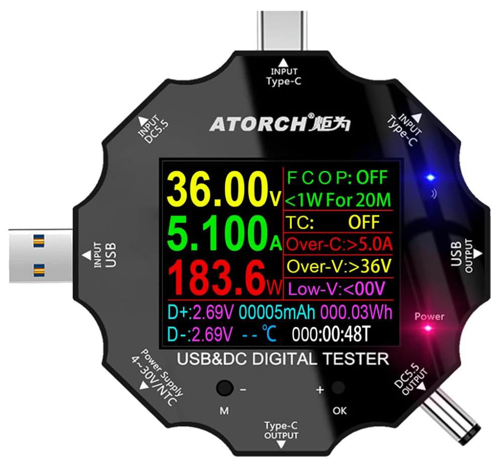

# ud18

[](https://github.com/lispnik/ud18/actions/workflows/ci.yml)

<p align="center">
  
</p>

A Common Lisp library and command-line tool for the **ATORCH UD18** USB/DC
power meter over Bluetooth LE: scan for it, connect, and decode its
measurement stream.

The wire protocol is undocumented. It was reverse-engineered here from a live
unit, and everything below distinguishes what was *confirmed* from what is
*inferred* — see [Protocol](#protocol).

```
$ ud18 scan
ADDRESS           TYPE    RSSI   NAME                 SERVICES
CB:3B:7F:8E:75:A3 public    -56  UD18_BLE             FFE0

$ ud18 monitor -m CB:3B:7F:8E:75:A3
 12.02 V     0.21 A      2.52 W     46.901 Ah     566.57 Wh  D-2.24 D+2.46   0C  198:48:53  @27 3C00000000000000
 12.03 V     0.22 A      2.65 W     46.901 Ah     566.57 Wh  D-2.16 D+2.46   0C  198:48:54  @27 3C00000000000000
 12.02 V     0.20 A      2.40 W     46.901 Ah     566.57 Wh  D-2.14 D+2.39   0C  198:48:55  @27 3C00000000000000
```

The trailing `@27` field is the part of each frame that this library **cannot
decode** — byte 27 and the seven after it. See
[Nothing is hidden](#nothing-is-hidden).

## What the device is

The UD18 is an inline voltage/current meter with a colour display. Its BLE
side is an HM-10-class serial-over-GATT bridge:

| | |
|---|---|
| Advertised name | `UD18_BLE` |
| Service | `0000FFE0-0000-1000-8000-00805F9B34FB` (16-bit `0xFFE0`) |
| Characteristic | `0xFFE1` — notify (measurements), write (commands) |
| Also present | `0xFFE2`, write-only, purpose unknown |
| Advertising | legacy, 1M PHY, connectable |
| Address | public on the test unit, despite a locally-administered-looking OUI |

There is no request/response cycle for reading. You connect, subscribe to
`0xFFE1`, and the meter pushes one 36-byte frame per second, forever, until
you disconnect. `0x1800` (Generic Access) is present but its characteristics
all return the same string `UD18_BLE` regardless of which one you read, so
there is nothing to learn there.

## Build

```sh
make          # build bin/ud18 (embeds the SBCL core, ~45 MB)
make test     # 2383 checks over the protocol core; needs no BLE stack
make clean
```

Third-party dependencies are vendored under `ocicl/`; `ocicl install` restores
them after a clone.

The shared [`ble`](https://github.com/lispnik/ble) library is **not** vendored,
because it is ours rather than something to fetch: check it out beside this
one, and the Makefile puts exactly that directory on the ASDF source registry
(`:directory`, not `:tree`, so we get `ble.asd` without also inheriting ble's
vendored dependencies and ending up with two copies of `cffi`).
Point `BLE_DIR` elsewhere if your checkout is:

```sh
make BLE_DIR=/path/to/ble
```

That is the one cost of not duplicating the BLE stack: this tree no longer
builds entirely on its own. The binary embeds the SBCL core, so build it on
the machine you intend to run it on.

## Tools

`bin/ud18` is a multicall binary. `ud18 <name> --help` prints the full flags.

| Subcommand | Kind | Purpose |
|---|---|---|
| `scan` | Live | Find meters in range; prints address, type, RSSI, name, services |
| `monitor` | Live | Stream live readings to the terminal |
| `record` | Live | Log live readings to a file (JSONL, CSV, text, or raw hex) |
| `decode` | Offline | Decode captured hex frames — runs anywhere, including macOS |
| `command` | Live | Send a command; `--list` needs no device |
| `raw` | Live | Send an arbitrary framed probe (the reverse-engineering escape hatch) |

```sh
ud18 scan --dev 0 --seconds 8
ud18 monitor -m CB:3B:7F:8E:75:A3 --seconds 30 --timestamps
ud18 record  -m CB:3B:7F:8E:75:A3 -o captures/run.jsonl
ud18 record  -m CB:3B:7F:8E:75:A3 -o captures/run.hex --format hex
ud18 decode  captures/run.hex --format csv > run.csv
ud18 decode  --hex FF5501030004B000001C00B6A1...
```

`--format hex` writes the raw frames and nothing else, and `decode` reads
exactly that back, so a recording can always be re-decoded later — useful
while any field below is still marked provisional.

## Protocol

Every frame — report, reply, or command — shares one envelope:

```
FF 55 <class> <device-type> <body...> <checksum>
```

**Checksum**: sum every octet from `<class>` up to but not including the
checksum, take the low byte, XOR with `0x44`.

```lisp
(logxor (logand (reduce #'+ frame :start 2 :end (1- (length frame))) #xFF) #x44)
```

Verified against all 321 captured frames, with no exceptions.

**Classes** seen or inferred: `0x01` report (device → host), `0x02` reply,
`0x11` command (host → device). **Device type** `0x03` is the USB/DC meter
family the UD18 belongs to.

### Measurement report — class `0x01`, device type `0x03`, 36 bytes

| Off | Len | Field | Scaling | Confirmed |
|---:|---:|---|---|---|
| 0 | 2 | magic `FF 55` | — | yes |
| 2 | 1 | class = `0x01` | — | yes |
| 3 | 1 | device type = `0x03` | — | yes |
| 4 | 3 | voltage, u24be | ÷100 → V | yes |
| 7 | 3 | current, u24be | ÷100 → A | yes |
| 10 | 3 | capacity, u24be | ×1 → mAh | yes |
| 13 | 4 | energy, u32be | ÷100 → Wh | yes |
| 17 | 2 | D− voltage, u16be | ÷100 → V | provisional |
| 19 | 2 | D+ voltage, u16be | ÷100 → V | provisional |
| 21 | 2 | temperature, u16be | ×1 → °C | provisional (reads 0) |
| 23 | 2 | run time hours, u16be | ×1 → h | yes |
| 25 | 1 | run time minutes, u8 | | yes |
| 26 | 1 | run time seconds, u8 | | yes |
| 27 | 1 | unknown | — | no (constant `0x3C`) |
| 28 | 7 | reserved, all zero | — | no |
| 35 | 1 | checksum | — | yes |

Power is not transmitted. The display computes it as V×I, and so does
`READING-WATTS`.

### Where the field meanings come from

Three sources, in increasing order of authority:

1. **Instrumenting the meter.** Establishes the framing, the checksum, and the
   scalings' consistency — and nothing else. It cannot name a field.
2. **The family protocol documentation** from two public projects. Gives the
   layout for the whole ATORCH range, some of which does not apply here.
3. **The manufacturer's own Android app**, `com.tang.etest.e_test` ("E-test"
   2.0), decompiled with `jadx`. It is small and unobfuscated, and its USB
   branch parses these exact offsets. This is what settled temperature, the
   backlight byte, and the unused tail.

The app is the reason three fields stopped being provisional:

- **Temperature** is a 16-bit value at offset 21, rendered as `N℃ / N℉` with
  the Fahrenheit conversion inline — so the unit is Celsius and the scale is 1.
  It reads zero on the test unit; that is the meter's own answer, not a decode
  error.
- **Byte 27 is the backlight timeout**, with three cases rather than a plain
  duration: `0` is *always off*, `60` is *always on*, anything else is that
  many seconds. So the `0x3C` this unit reports means the backlight never times
  out — reading it as "60 second timeout" would be wrong.
- **Bytes 28–34 are referenced nowhere in the app.** Not "unknown": unused.

### How the scalings were established

The three accumulators cross-check each other. Over a 387-second capture the
capacity counter advanced 26 units and the energy counter 31:

| | from the accumulator | from the instantaneous fields | error |
|---|---|---|---|
| mean current | 0.2419 A | 0.2392 A | 1.1 % |
| mean power | 2.8837 W | 2.8723 W | 0.4 % |

Two integrals matching their integrands to about one percent — the
quantisation floor of counters that tick once every few seconds — is strong
evidence that voltage, current, capacity and energy are scaled *consistently
with each other*.

It is not, however, enough to fix them absolutely. Multiplying current,
capacity and energy all by ten leaves every one of those relationships
intact: the physics is identical whether the meter is pushing 0.21 A into a
46.7 Ah total or 0.021 A into a 4.67 Ah one. The remaining factor of ten was
settled the only way it can be — by reading the unit's own display, which
showed 0.21 A and 46.7 Ah. The test
`capacity-and-energy-agree-with-the-instantaneous-readings` locks the
consistency in; the display reading is what anchors it.

Run time was pinned separately and directly: byte 26 increments exactly once
per frame and carries into byte 25 at 60, watched across minute boundaries.

### What is *not* known

- **Which of bytes 17–20 is D− and which is D+.** They are certainly the USB
  data lines — a pair of values around 2.1 V and 2.4 V that jitter together
  and are uncorrelated with load. But the vendor app displays both as bare
  voltages, in `TextView`s it recycles from the AC layout, so it never names
  them either. The ordering here follows the family protocol documentation and
  is the one thing the decompile did *not* settle.


## Commands

Commands are frames written to `0xFFE1`. **A command frame is ten octets** —
the value field is 32 bits, not 16:

```
off  len  field
  0    2   FF 55
  2    1   class = 0x11 (command)
  3    1   device type = 0x03 (USB meter)
  4    1   command
  5    4   value, u32 big-endian (0 when the command takes none)
  9    1   checksum, same rule as a report
```

That length is the whole ballgame, and it is worth saying loudly because
getting it wrong is silent. A command frame of any other length is **discarded
without a reply**. An eight-byte frame with a correct envelope and a correct
checksum produces exactly the same nothing as a nonsense opcode would, so a
full sweep of sixteen opcodes at the wrong length reads as "none of these do
anything" when it actually means "the meter never read any of them".

Every command the meter parses is answered with an eight-octet class-0x02
reply, `FF 55 02 01 <status> 00 00 <checksum>`:

| Status | Meaning | How it was established |
|---:|---|---|
| `01` | OK | documented, observed |
| `02` | wrong device type | sending a device-type other than `03` |
| `03` | unsupported command | documented, observed |
| `05` | wrong message class | sending a class other than `11` |
| `06` | malformed frame | a well-formed frame of the wrong length |

The last three were not documented anywhere; they were mapped here by feeding
the meter deliberately wrong frames and recording what came back. `06` is the
useful one — it distinguishes *"I do not know that command"* from *"I could
not read that frame at all"*, which is the exact confusion that cost the most
time.

### The command set

`ud18 command --list` prints this, annotated with what the tested unit does:

| Command | Opcode | Value | On the tested UD18 |
|---|---:|---|---|
| `reset-energy` | `01` | — | accepted — app: "accumulated energy will be cleared" |
| `reset-capacity` | `02` | — | accepted — app: "accumulated capacity will be cleared" |
| `reset-duration` | `03` | — | **verified** — run time went to zero |
| `reset-all` | `05` | — | accepted, but the vendor app never sends it |
| `plus` | `11` | — | **unsupported** (`03`) |
| `minus` | `12` | — | **unsupported** (`03`) |
| `set-backlight` | `21` | 0–60 | **unsupported** (`03`) |
| `set-price` | `22` | 1–999999 | **unsupported** (`03`) |
| `setup` | `31` | — | accepted (SETUP key) |
| `enter` | `32` | — | accepted (ENTER key) |
| `plus-usb` | `33` | — | **verified** — cycles display pages forward |
| `minus-usb` | `34` | — | **verified** — cycles display pages back |

*Accepted* means the meter replied `01` OK, so it parsed and took the command,
but the effect was not independently observed. *Verified* means it was:
`reset-duration` took the run-time clock from `200:45:39` to `0:00:06` in the
data stream, and `[+]`/`[-]` were watched cycling the meter's display pages.

The reset names are the vendor's own. The app puts each behind a confirmation
dialog whose text says exactly what it clears — 累计电量 (accumulated energy)
for `01`, 累计容量 (accumulated capacity) for `02`, 累计时间 (accumulated time)
for `03`. `05` appears in the family documentation as "reset all", and this
meter replies OK to it, but the app never sends it, so what it clears here is
untested.

The command builder in the app is worth quoting, because it is the whole
protocol in ten lines:

```java
public void send(int i, int i2, int i3, int i4, int i5) {
    byte[] bArr = new byte[10];
    bArr[0] = -1;  bArr[1] = 85;   // FF 55
    bArr[2] = 17;                  // 0x11, command
    bArr[3] = (byte) i;            // device type
    bArr[4] = (byte) i2;           // command
    bArr[6] = (byte) i3;  bArr[7] = (byte) i4;  bArr[8] = (byte) i5;
    bArr[9] = (byte) ((bArr[2]+bArr[3]+bArr[4]+bArr[5]+bArr[6]+bArr[7]+bArr[8]) ^ 68);
}
```

Note `bArr[5]` is never assigned — the value is effectively 24 bits in bytes
6–8, with byte 5 always zero. This library writes a 32-bit big-endian value
across bytes 5–8, which produces identical frames for every value the app can
send.

Note that `plus`/`minus` and their `-usb` counterparts are not duplicates. The
family protocol defines `11`/`12` for AC and DC meters and `33`/`34` for USB
meters, and this unit's behaviour matches exactly: it rejects the first pair
and accepts the second. That is a good sign the documented table really does
apply here.

```sh
ud18 command --list                                # no device needed
ud18 command -m CB:3B:7F:8E:75:A3 -c setup
ud18 command -m CB:3B:7F:8E:75:A3 -c reset-duration --yes
ud18 command -m CB:3B:7F:8E:75:A3 -c 40            # a raw opcode, for probing
ud18 command -m CB:3B:7F:8E:75:A3 -c setup --device-type 1   # an AC meter
```

The four resets are irreversible, so they require `--yes`. Every invocation
prints the exact frame before doing anything.

`--device-type` exists because the command set is the ATORCH family's, not
this model's: `3` is the USB meter, `1` an AC meter, `2` a DC meter. Only `3`
has been tested here, for the obvious reason.

### Sending frames the command set cannot express

`ud18 command` will only build well-formed ten-byte frames for commands it
knows. `ud18 raw` builds whatever you describe — any class byte, any device
type, any body length — wraps it in `FF 55` with a correct checksum, and shows
what comes back:

```sh
ud18 raw -m CB:3B:7F:8E:75:A3 --body 3100000000 --yes
ud18 raw -m CB:3B:7F:8E:75:A3 --class 18 --body 3100000000 --yes   # wrong class
```

It exists because every structural fact in this project was found with exactly
that capability. The status codes for wrong-device-type, wrong-message-class
and malformed-frame were mapped by sending deliberately wrong frames, and the
ten-octet command length — the one thing that made the command set reachable
at all — was found by sending the same opcode at several lengths and seeing
which drew a reply. A tool that can only emit correct frames cannot discover
what correct means. It refuses to transmit without `--yes`, and warns when the
frame is a length the meter is known to drop.

### Replies are unreliable — and the reason is the notification path

The meter does not answer every command. An earlier reading of this — that it
answers "roughly two commands in three" — was wrong, and the way it was wrong
is worth recording, because it is a trap this device sets.

Commands are written to `0xFFE1`, and every answer the meter gives comes back
as a *notification* on that same characteristic, as do the once-a-second
measurement reports. That firmware's notification path can stop entirely while
the rest of the device carries on: the GATT server keeps accepting
connections, keeps negotiating a 247-octet MTU, and keeps **acknowledging
writes**, but emits nothing at all. Measured directly — six acknowledged
commands in a row drew no reply, and a twelve-second `monitor` over the same
link returned `0 readings`.

That outage comes in two lengths. Usually it clears by itself within seconds.
Once it did not, and stayed down across repeated connections until the meter
was power cycled — after which the same commands answered immediately.

So the apparent per-command reply rate was never a probability. It was the
meter drifting in and out of a notifying state, sampled by commands that
happened to straddle the transition.

What is left, on a link that is demonstrably notifying, is a reply rate that
**decays with use since the last power cycle**. That is the one pattern that
reproduced every time it was looked for:

| when | what was sent | replied |
|---|---|---|
| immediately after a power cycle | `reset-all`, `enter`, `set-backlight` ×10 | **10/10** |
| after ~30 further connections | `enter` ×6, `reset-all` ×6, `minus-usb` ×6 | 4/18 |
| after ~70 | `enter` ×10, one connection | 4/10 |
| after ~80 | `enter` ×5, one connection | 1/5 |

It is not per-opcode. `reset-all` went 6/6 early and 0/6 later; `minus-usb`
looked like the flaky one at 11/14 until everything around it collapsed too.
It is not the transport either — an A/B of `--transport l2cap` against the
default `hci-user`, ten commands each, scored 0/10 and 0/10 in a degraded
window and both work fine in a healthy one.

It is also **not connection churn**, which is worth recording because it looked
for a while as though it were. Ten commands on a single persistent connection
scored 9/10 and then 10/10, straddling a fresh-connection-per-command control
that scored 3/6 — an A-B-A that reads as a clear win for holding the link open.
The identical script re-run later scored 4/10. Whatever the connection style,
the drift dominates it.

So the reliable move is the blunt one: **power-cycle the meter before a session
that needs answers.** Nothing in software has been found to substitute for it.

Two things follow, and both are implemented:

**Write with acknowledgement.** `0xFFE1` carries the `write` property as well
as `write-without-response`, and this used to take the latter. A
fire-and-forget write makes a lost command and an ignored command look
identical. A Write Request gets an ATT Write Response, so delivery becomes a
fact: `ud18 command` now reports `NOT SENT` (exit 3) when the write did not
land, and never confuses that with a command the meter took and ignored.
`--no-ack` restores the old behaviour for probing.

**Check the notification path before sending, and don't send into a dead one.**
`send-command` waits up to twelve seconds for a live measurement report before
writing. A healthy link returns almost at once — reports arrive about once a
second — so that window is only ever paid when something is wrong, and it is
long enough to ride out the transient outages entirely.

If no report arrives, the command is **not transmitted**: `ud18 command` says
`NOT SENT` and exits 4. That is the point of not sending. A reply could not
have come back, so writing would only produce a side effect nobody can
attribute — and for the half of the command set that is key presses, a retry
after that would press the key twice. Not sending keeps the retry provably
free. `--anyway` overrides it for the case where you want the meter to act and
accept that you cannot confirm it.

What is left after those two is genuinely inconclusive: an acknowledged write,
on a link that is demonstrably notifying, that draws no answer. That still
exits 2, distinct from a command the meter actively refused (exit 1).

Nothing retries automatically, and that is deliberate: half the command set is
key presses, and re-sending a key press that did arrive presses the key twice.
Retrying `NOT SENT` is always safe, whether or not the command is idempotent:
nothing was transmitted. That covers both the dead-notification case and a
write the meter never acknowledged.

`--command` also takes a comma-separated list, and `--repeat N` repeats it;
the whole batch goes out on one connection. That is worth doing for the time
it saves — a connect over Coded PHY costs about fifteen seconds — rather than
for any reliability it buys, per the table above.

```sh
ud18 command -m CB:3B:7F:8E:75:A3 -c enter,minus-usb --repeat 3
```

### Do not write text to 0xFFE1

`0xFFE1` is a transparent serial bridge to the meter's MCU — but the BLE
module sits in the middle, and it has its own AT command interpreter. Writing
`AT\r\n` to the characteristic during probing reached *the module*, not the
meter, and it answered `AT+BDUD18_SPP` on the notification channel. Worse, it
kept interleaving that text into the measurement stream afterwards, which
makes command replies arrive intermittently. A power cycle of the meter clears
it.

So: write framed `FF 55` commands, and nothing else. The library only ever
emits framed commands; the risk is in ad-hoc probing.

### Nothing is hidden

Undecoded data is shown, not dropped. There are two kinds, and both surface.

**Bytes the decoder cannot name**, inside a frame that decoded fine — byte 27
and the seven after it. Every output format carries them:

```
... 0C  198:48:53  @27 3C00000000000000     # text: trailing @offset field
{"...","undecoded":"3C00000000000000","raw":"FF5501..."}   # jsonl
...,0,715760,3C00000000000000,FF5501...                    # csv
```

They are on every line rather than behind a flag on purpose. On the unit this
was built against they are constant `0x3C` followed by zeros, so the moment
they are *not*, that is a discovery — and it should not depend on someone
thinking to go looking for it. `ud18 monitor --hexdump` dumps the whole frame
under each reading when you want everything.

**Frames that would not decode at all** — wrong length, bad magic, failed
checksum — are reported in full, because a frame we cannot read is exactly
the one worth seeing:

```
$ ud18 decode --hex ff5501030004b0...3c
!! skipped, 36 bytes: UD18 frame checksum mismatch: frame carries 0x3C, computed 0x3B.
   0000  FF 55 01 03 00 04 B0 00  00 1C 00 B6 A1 00 00 DC  |.U..............|
   0010  A0 00 D6 00 ED 00 00 00  C6 0B 08 3C 00 00 00 00  |...........<....|
   0020  00 00 00 3C                                       |...<|
```

`monitor` and `record` print the same dump on stderr as frames arrive, so a
recording is never quietly short. `record --format hex` additionally writes
the raw bytes into the capture behind a `#` comment, which `decode` skips —
so a hex capture stays lossless even for frames it cannot read.

## Library

Two systems, split on the platform seam:

- **`ud18/core`** — framing, checksum, measurement decoding. Depends only on
  `ble/core`, which has no dependencies of its own, so it still runs
  anywhere, macOS included, and the test suite still needs no BLE stack. It
  does need the sibling `ble` checkout to be present — see
  [Build](#build).
- **`ud18/ble`** — connecting to a meter and streaming from it. Adds
  [`ble`](https://github.com/lispnik/ble), the shared BLE library, which brings the HCI
  sockets, LE scanning and the ATT/GATT client. **Linux only**, and needs
  `CAP_NET_RAW` + `CAP_NET_ADMIN`.

```lisp
(ql:quickload :ud18)

;; Offline: decode a frame.
(let ((r (ud18:decode-frame #(#xFF #x55 #x01 #x03 ...))))
  (format t "~,2F V ~,2F A ~,2F W~%"
          (ud18:reading-volts r) (ud18:reading-amps r) (ud18:reading-watts r)))

;; Live: connect and stream.
(ud18:with-connection (c "CB:3B:7F:8E:75:A3" :dev 0)
  (ud18:stream-readings c
                        (lambda (r) (print (ud18:reading-watts r)))
                        :seconds 30))
```

`DECODE-FRAME` signals a subtype of `UD18:FRAME-ERROR` on a bad length,
missing magic, failed checksum, or unverified device type.
`DECODE-FRAME-OR-NIL` returns `(values nil condition)` instead, which is what
you want inside a receive loop: one corrupt notification is not a reason to
tear down a stream that will produce another next second.

Addresses are held **on-air (LSB-first)** everywhere inside the library,
because that is what BlueZ wants; `BLE:PARSE-MAC` and `BLE:FORMAT-MAC` are the
only places the display order exists.

## Transports, and why there are two

Reaching the meter should be a matter of opening an L2CAP socket bound to the
ATT fixed channel and letting the kernel make the LE connection. On the
Raspberry Pi 4 this was developed against, that path is **unreliable**: for
the first half of a development session it failed every single time — a
blocking `connect(2)` sitting a full 40 seconds and returning `EINPROGRESS`,
with or without a source bind, on an adapter that could see the device, against
a peer that BlueZ's own D-Bus API connected to on demand. Another project
using the same stack hit the identical wall on the same hardware, so it is not
something peculiar to this meter.

What broke the deadlock was taking the adapter over and issuing an HCI Reset.
After that the kernel path started working and has worked since. So the
failure looks like adapter state — something, plausibly a scan left enabled by
an earlier tool, wedging the controller's initiator — rather than a permanent
property of the host. That is a diagnosis, not a proof; it has not been root-
caused.

Hence two transports:

- **`:hci-user`** (default) — `HCIDEVDOWN`, then bind an `HCI_CHANNEL_USER`
  socket and *be* the host: reset and initialize the controller, issue LE
  Create Connection directly, and carry ATT PDUs inside L2CAP B-frames inside
  HCI ACL data. Nothing else touches the controller while we hold it. It has
  connected on every attempt, including from the wedged state that defeated
  the kernel path — the reset is very likely why.
- **`:l2cap`** — the kernel-assisted path. Much less invasive: it leaves the
  adapter with the kernel, needs no `CAP_NET_ADMIN`, and does not disturb
  bluetoothd or anything else sharing the radio.

`--transport` selects between them. The default is the one that has never
failed here, but it is the heavier hammer: if you are sharing the adapter,
try `--transport l2cap` first, and fall back when it hangs.

The takeover is reversible, and the binary works hard to always reverse it:
every exit path in `ble`'s HCI-CONN code closes the socket and re-ups the
adapter, every open channel is registered in `BLE:*OPEN-ATT-CHANNELS*`, and
`bin/ud18` calls `BLE:INSTALL-ADAPTER-TEARDOWN`, which turns SIGTERM and
SIGHUP into an orderly exit with a teardown hook. That last
part is not decoration — SBCL does not exit on SIGTERM by default, and a
`timeout 60 ud18 monitor ...` during development left a process alive holding
the radio. While it held it, *nothing* else on the machine could use hci0;
even `hciconfig hci0 down` as root returned `EBUSY`, and `btmgmt` reported
the adapter as an invalid index. It took a SIGKILL to clear.

`SIGKILL` still cannot be caught. If that happens, `sudo hciconfig hciN up`
puts the adapter back. That residual risk is the real cost of the default: a
failed `:l2cap` attempt costs you 15 seconds, while a `kill -9` during an
`:hci-user` session costs a manual recovery.

**Symptom to recognise:** `bind(HCI_CHANNEL_USER) ... Device or resource
busy`, with `hciconfig hciN down` also refusing as root. That is a process
still holding the user channel, not a broken adapter. `ps -C ud18` will find
it.

### Capabilities

```sh
sudo setcap 'cap_net_raw,cap_net_admin+eip' bin/ud18
```

`CAP_NET_ADMIN` is needed as well as `CAP_NET_RAW`, because the `:hci-user`
transport downs and re-ups the adapter.

Capabilities live on the file, so **`make` drops them** — a rebuilt binary
fails with `bind(HCI_CHANNEL_USER) failed: Operation not permitted`. Re-run
the `setcap` after every build.

### Picking an adapter

`--dev` defaults to the **lowest-numbered adapter**, not the first USB one,
and overrides `ble`'s own default deliberately. That default prefers a USB
dongle because reaching the Coded PHY usually needs one; the UD18 is an
ordinary 1M-PHY advertiser with no such requirement — and on the development
Pi it is in fact *only* the built-in radio that hears it, while both USB
dongles report nothing at all. `hciN` numbering also drifts across reboots.
When in doubt, run `ud18 scan --dev N` on each index and use whichever
answers.

## Layout

```
src/protocol.lisp   framing, checksum, decoding      (portable)
src/commands.lisp   the command set + replies        (portable)
src/device.lisp     connect / subscribe / stream     (Linux; on top of `ble`)
cli/                one file per subcommand
tests/              FiveAM suite over the core
captures/           the capture the protocol was derived from
```

`ble` speaks ATT over an abstract "channel" that is either an integer fd
(kernel L2CAP socket) or an `HCI-CONN`; `ATT-SEND` and `ATT-RECV` dispatch on
which, so every line of ATT protocol is shared by both transports. This
project used to carry its own copy of that machinery — about 1200 lines of
HCI sockets, scanning, ATT and the two transports. The parts of it that were
better than the shared library were moved into `ble`; the copy is gone. See
[Building](#build).

`captures/ud18-2026-08-19.hex` is 321 real frames from the unit, and the test
suite asserts against them rather than against hand-written bytes — a test
built from bytes someone made up only proves the decoder agrees with whoever
made them up.
